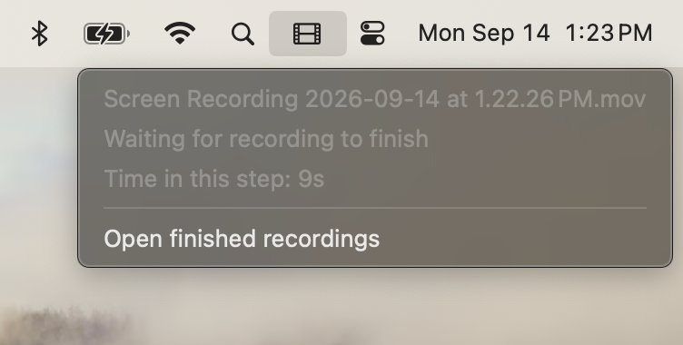
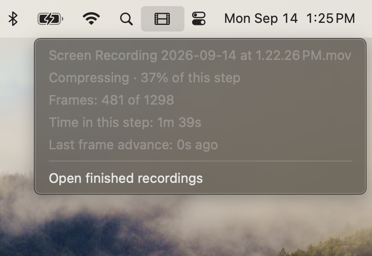

# Screen Recording Cleaner

Record with **⌘⇧5**. A smaller, verified copy appears in **`~/Downloads/screen-recordings`**. The original stays in **`~/Desktop/screen recordings`**, with its filename and contents intact.

macOS launches the processor when the recording folder changes. It waits for unfinished recordings, processes them, and **exits completely when enabled with no work left**. While explicitly paused, only a small native menu remains so you can see the pause and resume it. There is no periodic scan or idle timer. This is a personal convenience tool; a missed notification or crash can require a manual rerun.

A small **film icon in the menu bar appears while work is pending or processing is paused**. Click it to see the recording, **Step X of 5**, elapsed time, and actual frame progress during compression and playback verification. When paused, it says **Paused** beside the icon and offers **Resume processing**. It disappears when automatic processing is enabled and all work is finished.

The icon starts near the clock, with progress percentages inside the menu so it stays compact. While it is visible, hold **⌘ and drag** to move it; macOS remembers the position for the next recording. This avoids placing a new, wide indicator behind the camera notch on a crowded menu bar.

For agent work, start with the [Screen Recording Cleaner skill](SKILL.md) or its short [rebuild prompt](PROMPT.md). The skill defines the agreed update for hardware encoding and size/quality choices; the implementation described below still uses the existing software encoder and soft size target until that update ships.

## Menu bar progress

These screenshots show the earlier menu; the current version also has step numbers, **Pause processing**, and a persistent **Paused / Resume processing** state.

**Waiting for the recording to finish:**



**Compressing, with frame progress and elapsed time:**



## One-click install

1. [Download this repository as a ZIP](https://github.com/Drew-Goddyn/tools/archive/refs/heads/main.zip) and extract it, or clone it.
2. Open this folder and **double-click `Install.command`**. Keep the folder together.

The installer sets up Homebrew, Python 3.11+, and FFmpeg if needed, then installs the processing job and a paused-menu job for your macOS account. It upgrades FFmpeg when decoded-frame statistics are unavailable; a direct install or upgrade checks this capability before changing the service. The paused-menu job exits at startup when processing is enabled. Homebrew may ask for your password or Apple's Command Line Tools; its [current system requirements](https://docs.brew.sh/Installation) apply. It compiles the small menu-bar display with the Swift compiler from Apple's Command Line Tools before changing an existing service. Run as your normal user, without `sudo`. Apple Silicon has been tested; the installer also recognizes Intel Homebrew paths.

**Allow macOS's Desktop and Downloads folder prompts for Python when they appear.** The first save may wait for that permission. The installer does not grant itself privacy permissions or configure Full Disk Access.

Setup sets Screenshot's save location to the recording folder. macOS shares that setting between screenshots and recordings, so screenshots go there too; the processor ignores them. Existing installations retain their configured folders. Close an already-open Screenshot toolbar before recording again.

Terminal, Codex, and this downloaded package can all be closed afterward. The installed copy lives in `~/Library/Application Support/Screen Recording Cleaner`. Run `Install.command` again to upgrade or resume interrupted setup without resetting history.

## Everyday behavior

- New immediate `.mov` and `.mp4` files are eligible. Screenshots, hidden files, symlinks, and nested folders are ignored.
- A recording must keep the same size and modification time for **30 seconds** and have no open writer before processing starts. Encoding and validation take additional time.
- Finished names end in `- clean`. Destination files are never overwritten. Recordings present before first installation stay excluded.
- **20,000,000 bytes is a soft target**, with **picture quality and processing time taking priority**. A large reduction is useful even when the result stays above 20 MB; the cleaner keeps that result without extra size-targeting passes.
- Notifications are requested for failures and files retained above 20 MB. Routine completion is quiet.

## Quality and original protection

Files already under the target are copied exactly, preserving their container. Larger standard SDR recordings are encoded as H.264 MP4 at the original resolution and frame timing, using the `fast` software preset, CRF 18, and four encoder threads. AAC and ALAC audio are copied; other audio formats are converted to AAC. HDR, rotated, and higher-bit-depth recordings keep their original format.

The cleaner makes one high-quality encode and keeps it, even above 20 MB. It does not run additional bitrate-targeted encodes or comparisons just to cross that threshold. If encoding increases size, the original is copied.

Compression counts decoded input frames as it works. A single playback check then decodes the complete result, checks audio, and compares frame counts and individual frame timing. This removes two full video passes from the earlier version. Exact copies are compared byte for byte and decoded once. Quick metadata checks still verify dimensions, duration, and audio track/channel counts; the source must remain unchanged. Publication is atomic and never replaces a file. Saved publication intent allows interrupted publication to recover without duplicating a finished copy.

The faster preset keeps the existing quality setting and soft size target. Upgrades preserve your configuration; an omitted `preset` now means `fast`. Set `"preset": "slow"` in the installed `config.json` to use the earlier encoder effort. This is still software encoding: hardware encoding produced much larger files at comparable measured quality on the tested recordings. See the [performance comparison](docs/performance.md) for measurements and their limits.

## How it starts and stops

One `launchd` job uses `WatchPaths` for the recording folder and `RunAtLoad` for a reconciliation at login or resume. The job passes its own launchd target to the menu so Pause affects that job only. It uses `ProcessType: Standard`, CPU nice level 10, and low-priority disk access. This permits faster processing than macOS's more restrictive Background class while giving foreground work higher priority. The encoder uses four threads by default. CPU activity can be higher while processing, but finishes sooner; enabled idle behavior is unchanged. The job has no `KeepAlive`, `StartInterval`, or calendar schedule.

A separate native menu job starts once at login, checks whether processing is paused, and exits immediately if it is enabled. While paused, it shows the Resume control without scanning folders, launching Python, or scheduling timers. macOS restarts this menu if it crashes, using `KeepAlive: {SuccessfulExit: false}` and a 30-second throttle. Resuming closes it with an explicit event; there is no recurring status check. These are [native launchd lifecycle controls](https://github.com/apple-oss-distributions/launchd/blob/main/man/launchd.plist.5).

The Python processor scans for work and owns all history, encoding, and publication. While a known recording is unfinished, it waits for its next readiness or retry deadline. A temporary native directory watch can wake that wait when another file arrives. Failed recordings retain the existing retry backoff, up to one hour. Deleting a pending recording removes that work. Once nothing is pending, the processor closes its watch and exits; FFmpeg runs only during processing.

Files arriving during encoding are collected before exit. Duplicate notifications are harmless because history prevents repeated output. A startup scan collects recordings made while the job was stopped.

**Delivery is best effort.** Apple's `launchd.plist` manual warns that `WatchPaths` notifications can be missed. A final folder check reduces the shutdown gap but cannot eliminate it. A crash, a notification missed at shutdown, or a removed/replaced recording folder can leave a recording waiting for the next folder change, login, or manual rerun. The processor has no automatic crash-restart loop or periodic recovery check. Originals and processing history remain available for recovery. A corrupt unfinished file can keep the processor waiting on retries until it is fixed or removed from the watched folder.

This tradeoff keeps the current folders and a fully exiting processor. A persistent listener or an inbox that empties after processing would provide stronger automatic recovery, at the cost of a different workflow. They are deliberately outside this version. See [Apple's launchd guide](https://developer.apple.com/library/archive/documentation/MacOSX/Conceptual/BPSystemStartup/Chapters/CreatingLaunchdJobs.html) and the local `man launchd.plist` for the native trigger behavior.

## Status and recovery

**Usually, just click the film icon in the menu bar.** It shows:

- The current recording and a compact numbered stage, such as **Step 2 of 5 · Compressing**.
- A percentage and frame count during compression and playback verification. The percentage belongs to that step; validation follows compression.
- Time spent in the step and when the frame count last advanced. If frames stop advancing for a minute, it says so without claiming the process is definitely stuck. Metadata reads, copying, and file-integrity checks have no percentage because those operations do not report live progress. The compression percentage can use the container's frame count as an estimate; verification uses actual decoded frames.
- **Open finished recordings**, which opens the configured output folder.
- **Pause processing**, which stops the whole batch and disables automatic processing until you resume it.

The five stages are:

| Step | Menu label | What happens |
| --- | --- | --- |
| 1 | Reading recording | Reads metadata to choose compression or an unchanged copy. It no longer decodes the whole original before compression. |
| 2 | Compressing / Copying unchanged | Makes one quality encode while counting decoded input frames, or copies a recording that is already small enough or needs its original format. |
| 3 | Checking copy | Compares resolution, duration, and audio metadata. Unchanged copies are also checked byte for byte. |
| 4 | Checking playback | Decodes the complete copy to check video and audio playback, decoded frame counts, and frame timing. |
| 5 | Saving finished copy / Saving smaller original | Checks file integrity and publishes the result. If the encode is larger, it copies the original unchanged instead. |

The count starts at one for each recording. Waiting for a recording to finish or for a retry sits outside those five stages. Elapsed time measures how long a step has been running; it does not establish that frames are advancing. The menu keeps these explanations out of the way.

**Pause processing** uses macOS to disable future launches, then stop the worker and its child processes. The worker kills and reaps an encoder that has not exited, so pause releases its memory instead of suspending it. The film icon stays visible with **Paused** beside it and **Resume processing** in its menu. Only this native menu remains; Python and FFmpeg stop. Originals and completed copies stay intact; an interrupted recording starts over after resuming, which also removes its temporary work. Pause persists across logins and restarts.

To resume, click **Resume processing** in the film menu. You can also double-click **`Resume Screen Recording Cleaner.command`** in your finished-recordings folder, or [**`Resume.command`**](Resume.command) in this tool's folder. It enables the job and collects unfinished recordings and recordings made while paused. If an unrelated file already uses the shortcut's name, installation adds a numbered suffix. Upgrading preserves the pause and restores the paused menu. Resume before a manual rollback; rollback stops with instructions while paused.

The display takes no keyboard focus, opens no window, and adds no Dock icon. During processing it receives updates through a pipe and exits when the processor closes that pipe or dies. The paused menu is independent, so stopping the encoder leaves Resume available. It does not watch folders or run an idle schedule. One delivery thread waits on pipe events while the display is active, retaining the newest snapshot if the display is slow. A failed display does not block processing. Set `"show_progress": false` in the installed `config.json` to disable processing progress for subsequent runs. An explicit pause remains visible.

Read processing history and the most recent run:

```sh
python3 "$HOME/Library/Application Support/Screen Recording Cleaner/cleaner.py" \
  --config "$HOME/Library/Application Support/Screen Recording Cleaner/config.json" status
```

`runner.state: idle` means that run finished. `waiting` means a recording or retry was pending. The saved snapshot can be stale after a pause or crash; check whether macOS currently has a process running:

```sh
launchctl print "gui/$(id -u)/local.screen-recording-cleaner"
```

When idle, it should report `state = not running` with no PID and `last exit code = 0`.

**If a recording has not appeared, rerun processing:**

```sh
launchctl kickstart "gui/$(id -u)/local.screen-recording-cleaner"
```

This leaves an already-running encode alone. Check for a macOS Downloads permission prompt if saving appears stuck. Errors are in the status output and the installed `launchd.log` or rotating `state/events.log`. Do not delete `state/state.json`: it contains processing history and protects the old archive from reprocessing.

Pause from the menu, or run:

```sh
launchctl disable "gui/$(id -u)/local.screen-recording-cleaner"
launchctl bootout "gui/$(id -u)/local.screen-recording-cleaner"
launchctl kickstart "gui/$(id -u)/local.screen-recording-cleaner.paused-menu"
```

Resume with the one-click shortcut, or run the installed command:

```sh
bash "$HOME/Library/Application Support/Screen Recording Cleaner/Resume.command"
```

## Upgrade and rollback

`Install.command` waits for an active encode, takes the existing history lock, backs up the installed programs and launch configuration, and replaces them. A previous resident listener is removed. After the lock is released, an enabled installation starts processing; a paused installation restores its Resume menu without enabling processing. Folder settings and the latest processing history are preserved.

The menu display is built before cutover. A compiler failure leaves the current service running. Rollback restores the previous display and menu-job registration, or removes them when rolling back to a version that did not have them. A failed upgrade keeps the prior pause state and never resets processing history.

Setup checks that the processor starts or finishes successfully. If activation fails after replacement, it restores the prior service. Interrupted upgrades can resume from the same package. Keep this package to run these management commands:

```sh
# Restore the previous programs and launch configuration, retaining current history.
python3 install.py rollback

# Restore Screenshot's save location from before first setup.
python3 install.py restore-capture-location
```

Backups and upgrade progress live in the installed `backups/` and `upgrade.json`. Rollback never copies an old ledger over newer results. It restores the previous scheduling behavior, which may include a resident listener or polling. Restoring the Screenshot preference is separate and respects a location you selected yourself after installation.

## Development and verification

```sh
python3 -m unittest -v test_progress test_cleaner test_validation test_install test_upgrade test_setup
python3 -m unittest -v test_progress_native test_menu_controls
python3 -m unittest -v test_lifecycle
python3 verify_idle.py --output /tmp/recording-cleaner-idle.json
```

The first suite tests encoding, history, publication, installation, actual FFmpeg progress, and broken or backpressured display pipes; launchctl and preference commands are doubled in installer tests. Real-media tests cover variable frame timing, AAC/ALAC/PCM audio, corrupt video, missing frames, and changed timestamps. A termination test makes an encoder child ignore the normal stop signal and requires the worker to kill and reap it. A six-second paced generated clip proves intermediate frame advances without depending on a large fixture. The lifecycle suite creates a temporary real macOS launch job and generated movies under `/private/tmp`, then unloads it. It checks actual creation/copy/rename triggers, slow writes, overlapping arrivals, completion, and recovery after a stopped or crashed run. A command sandbox may require normal macOS service access for these tests.

Build the display with `python3 build_progress.py`. The opt-in native display tests briefly show a test menu item, check normal exit on pipe closure, and kill an isolated parent to check crash cleanup. The menu-controls test reads actual AppKit rows and selects Pause and Resume programmatically in isolated launchd jobs. It checks that encoding stops while the paused menu stays available without progress timers, restores the menu after a crash and registration reload, verifies delivery on Resume, checks the external shortcut, and confirms both jobs stop launching once idle. These tests do not simulate a physical menu click or a Finder double-click. For desktop verification, check the menu during real processing, including the change from compression to verification. The display uses [Apple's native status-item API](https://developer.apple.com/documentation/appkit/nsstatusitem) and [FFmpeg's documented progress output](https://ffmpeg.org/ffmpeg.html). It receives full snapshots with the time frames actually advanced, so delayed display updates do not pretend a frame just advanced.

Placement uses a stable AppKit autosave name and registers an initial default for AppKit's undocumented `NSStatusItem Preferred Position` preference. An existing saved position takes precedence. The app exits without explicitly removing the item, which would clear the saved position. Check actual placement on the target Mac: AppKit can report `isVisible` as true even when an item is hidden behind the notch.

The idle observer is manually invoked and never installed as a service. It requires five quiet minutes with no job PID, display or worker-group processes, launches, scans, waits, or status/log changes. It fails if recording activity occurs during that window. These checks demonstrate the tested cases; they do not turn `WatchPaths` into guaranteed delivery.

A folder notification can arrive just after a run exits and cause one more no-work run. Let notifications from the last recording or deletion finish before observing idle; this is distinct from a recurring check.
