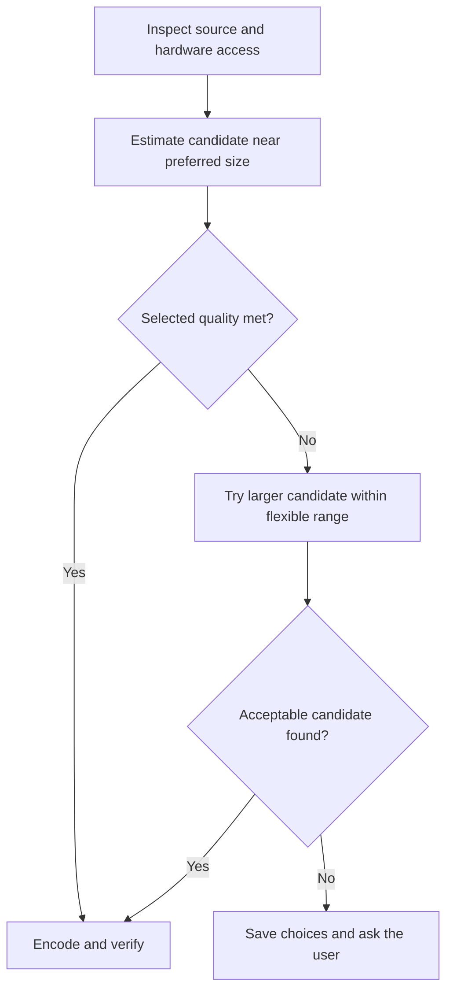

# Encoding and quality decisions

## Preferences

Use hardware HEVC as the default for supported recordings. Keep resolution,
individual frame timing, and audio unless the user explicitly chooses a different
transform. Apply [preservation.md](preservation.md) when implementing that path.

Separate file size from acceptable visual change:

| Preference | Default |
| --- | --- |
| Preferred size | About 50 MB |
| Flexible upper bound | About 100 MB |
| Quality | Close to original |
| Other quality choices | Balanced; Smaller and softer |
| Hard upload limit | Unset; enable only for an explicit limit |

MB means 1,000,000 bytes. A result such as 52 MB meets the preferred-size intent;
extra encoding solely to cross 50 MB is wasteful. Accept smaller results when
quality holds. The upper bound is a preference, not permission to silently
sacrifice quality or publish an arbitrarily large file. Ask when saved preferences
cannot be met. An explicit hard limit requires a final byte-count check.

Copy an already-small source exactly. For a source inside the flexible band,
keep the original if encoding cannot make a worthwhile reduction at the chosen
quality. If an encode is larger than its source, use the original and surface any
remaining size conflict. Resolve decisions through
[interaction.md](interaction.md).

## Select a candidate

Use source duration, all audio tracks, and mux overhead to estimate each video
bitrate budget. A rough starting point is:

`video_bps = target_bytes * 8 / duration_seconds - audio_bps - mux_overhead_bps`

A nonpositive video budget is infeasible. Estimates need headroom and final
measurement; a bitrate request does not guarantee an exact output size. A fixed
bitrate from one recording is not a universal quality setting.

Start near the preferred size. If sampled quality is insufficient, allow more
bytes before reducing detail. Sizes around 50, 65, 80, and 100 MB illustrate the
search; adapt candidates to duration, complexity, source size, and user settings.
Stop at the smallest candidate that meets the selected quality preference.

Bound analysis work so it does not erase the hardware advantage. Prefer a few
short, distributed samples including motion and fine detail over a full CPU-heavy
quality scan. Benchmark the analysis budget together with the complete pipeline;
short or already-acceptable clips should not pay for an elaborate search.

Normally perform one full encode. Permit at most one automatic correction for a
specific measured miss within the analysis/attempt budget. Start every encode
from the original. When the budget expires, retain measured options and request
a choice; avoid repeated encodes or silent relaxation of quality.

## Calibrate the quality scale

Before choosing shipping thresholds, compare representative original captures:
small text, moving scenes, gradients, different durations, audio, and variable
frame timing. Align the actual source frames before calculating similarity.
Combine sampled image metrics with text/detail-region checks and synchronized
visual examples. Calibrate each quality label against the source and current
cleaner; do not equate a similarity score with a percentage of quality retained.

For starting evidence and its limits, read [calibration.json](calibration.json).
Those measurements used one excerpt of an already-compressed recording and timed
encoding alone. The older H.264 hardware comparison in
[the performance report](../docs/performance.md) does not establish HEVC's tradeoff.

Record candidate settings, sampled evidence, estimated/actual bytes, and total
wall/CPU time. Sampled checks remain estimates of whole-recording visual quality.
Full-file integrity verification remains required independently.

## Hardware failures and compatibility

Test a short real hardware session using the source settings, with software
fallback disabled (`hevc_videotoolbox -allow_sw 0` for the current FFmpeg path).
An encoder listed in FFmpeg is not proof that a session can start.

A `-12908` creation failure alone does not distinguish inaccessible services,
unsupported settings, or resource problems. Isolate it with the same short sample
and a basic control. Compare the normal service context with a restricted command
context when authorized; retain logs and keep test output separate. Request normal
execution access if needed instead of treating a sandbox failure as missing
hardware or changing security settings.

For a transient failure, use a bounded retry and preserve the cause. Otherwise
save a decision offering retry later, the original, or software for this recording.
Software fallback requires an explicit choice; it must not silently restore the
high CPU load the user chose hardware to avoid.

If a destination needs H.264, treat that as a separate compatibility preference
and test hardware H.264 at the chosen quality. Preserve protected formats through
the existing copy path until their conversion has been explicitly supported and
verified.
